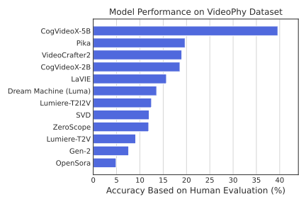

# VideoPhy
 
 


This repository contains the official implementation and data for "VideoPhy:
Evaluating Physical Commonsense In Video Generation".

[[Webpage](https://videophy.github.io/)] [[Paper](https://arxiv.org/abs/2406.03520)] [[Test Dataset 🤗](https://huggingface.co/datasets/videophysics/videophy_test_public)] [[Leaderboard](https://github.com/Hritikbansal/videophy/tree/main?tab=readme-ov-file#leaderboard-)] [[AutoEvaluator](https://huggingface.co/videophysics/videocon_physics/tree/main)] [[Twitter](https://twitter.com/hbXNov/status/1798803363473064203)]

<!-- <h1 align="center"></h1> -->
<p align="center">
     <br>
  Illustrative figure for <b>VideoPhy</b>. Generated by DALL·E 3.
</p>

## Updates

**10 Oct 2024:** We have added CogVideoX-2B/5B and Dream Machine (LumaAI) human predictions to [test data](https://huggingface.co/datasets/videophysics/videophy_test_public). \
**11 Oct 2024:** We ran our auto-evaluator for video-text alignment and physical commonsense on the videos from the test data. We release the auto eval scores [here](https://huggingface.co/datasets/videophysics/videophy_autoeval_scores).
## Abstract
Recent advances in internet-scale video data pretraining have led to the development of text-to-video generative models that can create high-quality videos across a broad range of visual concepts and styles. Due to their ability to synthesize realistic motions and render complex objects, these generative models have the potential to become general-purpose simulators of the physical world. However, it is unclear how far we are from this goal with the existing text-to-video generative models. To this end, we present VideoPhy, a benchmark designed to assess whether the generated videos follow physical commonsense for real-world activities (e.g. marbles will roll down when placed on a slanted surface). Specifically, we curate a list of 688 captions that involve interactions between various material types in the physical world (e.g., solid-solid, solid-fluid, fluid-fluid). We then generate videos conditioned on these captions from diverse state-of-the-art text-to-video generative models, including open models (e.g., VideoCrafter2) and closed models (e.g., Lumiere from Google, Pika). Further, our human evaluation reveals that the existing models severely lack the ability to generate videos adhering to the given text prompts, while also lack physical commonsense. Specifically, the best performing model, Pika, generates videos that adhere to the caption and physical laws for only 19.7% of the instances. VideoPhy thus highlights that the video generative models are far from accurately simulating the physical world. Finally, we also supplement the dataset with an auto-evaluator, VideoCon-Physics, to assess semantic adherence and physical commonsense at scale.
<h1 align="center"></h1>

## Human LeaderBoard 🏆
We evaluate 10 closed and open text-to-video generative models on VideoPhy dataset with **human annotation**. We report the percentage of testing prompts for which the T2V models generate videos that adhere to the conditioning caption and exhibit physical commonsense. We abbreviate semantic adherence as **SA**, physical commonsense as **PC**. **SA=1** signifies that the video aligns with given text semantics, while **PC=1** indicates alignment with intuitive physics. Rankings are based on **SA=1, PC=1** scores. 

<div align="center">

| **#** | **Model** | **Source** | **SA=1, PC=1** | **SA=1** | **PC=1** |
| -- | --- | --- | --- | --- | --- |
| 1      | [CogVideoX-5B](https://github.com/THUDM/CogVideo)🥇 | Open |  **39.6**  | **63.3**   | **53**    |
| 2 | [Pika](https://pika.art/)🥈 | Closed | 19.7 | 41.1 | 36.5 |
| 3 | [VideoCrafter2](https://arxiv.org/abs/2401.09047)🥉 | Open |19.0 | 48.5 | 34.6 |
| 4 | [CogVideoX-2B](https://github.com/THUDM/CogVideo) | Open |18.6 | 47.2 | 34.1 |
| 5 | [LaVIE](https://arxiv.org/abs/2309.15103) | Open | 15.7 | 48.7 | 28.0 |
| 6 | [Luma Dream Machine](https://lumalabs.ai/dream-machine) | Closed  | 13.6   | 61.9   | 21.8    |
| 7 | [Lumiere-T2I2V](https://arxiv.org/abs/2401.12945) | Closed | 12.5 | 48.5 | 25.0 |
| 8 | [SVD-T2I2V](https://arxiv.org/abs/2311.15127) | Open | 11.9 | 42.4 | 30.8 |
| 9 |  [ZeroScope](https://huggingface.co/cerspense/zeroscope_v2_576w) | Open | 11.9 | 30.2 | 32.6 |
| 10 | [Lumiere-T2V](https://arxiv.org/abs/2401.12945) | Closed | 9.0 | 38.4 | 27.9 |
| 11 | [Gen-2 (Runway)](https://arxiv.org/abs/2302.03011) | Closed | 7.6 | 26.6 | 27.2 |
| 12 | [OpenSora](https://github.com/hpcaitech/Open-Sora) | Open | 4.9 | 18.0 | 23.5 |

</div>

## Automatic LeaderBoard 🏆
We evaluate 12 closed and open text-to-video generative models on VideoPhy dataset with **our own auto evaluator (see our paper for more details)**. We report the percentage of testing prompts for which the T2V models generate videos that adhere to the conditioning caption and exhibit physical commonsense. We abbreviate semantic adherence as **SA**, physical commonsense as **PC**. **SA=1** signifies that the video aligns with given text semantics, while **PC=1** indicates alignment with intuitive physics. Rankings are based on average of **SA=1, PC=1** scores. 

<div align="center">

| **#** | **Model**      | **PC=1** | **SA=1** | **Avg.** |
|----------|----------------|--------|--------|---------|
| 1      | [CogVideoX-5B](https://github.com/THUDM/CogVideo)🥇          |  41  | 57   | 49    |
| 2     | [Luma Dream Machine](https://lumalabs.ai/dream-machine)🥈   | 30   | 53   | 41.5    |
| 3      | [VideoCrafter2](https://arxiv.org/abs/2401.09047)🥉          | 36   | 47   | 41    |
| 4      | [LaVIE](https://arxiv.org/abs/2309.15103)          | 36   | 45   | 41    |
| 5     | [CogVideoX-2B](https://github.com/THUDM/CogVideo)   | 39   | 40   | 39    |
| 6        | [Lumiere-T2I2V](https://arxiv.org/abs/2401.12945)  | 25   | 46   | 35    |
| 7        | [SVD-T2I2V](https://arxiv.org/abs/2311.15127)            | 34   | 37   | 35    |
| 8        | [ZeroScope](https://huggingface.co/cerspense/zeroscope_v2_576w)     | 42   | 27   | 34    |
| 9        | [Lumiere-T2V](https://arxiv.org/abs/2401.12945)   | 31   | 35   | 33    |
| 10        | [Pika](https://pika.art/)           | 33   | 25   | 29    |
| 11        |[Gen-2 (Runway)](https://arxiv.org/abs/2302.03011)         | 31   | 26   | 29    |
| 12       | [OpenSora](https://github.com/hpcaitech/Open-Sora)       | 35   | 21   | 28    |
</div>
Why pika is 'low'? Our training data might not be enough for Pika, and better automatic evaluator is an active area of research."

## Examples 📷
We provide one good and one bad examples for several models in terms of physical commonsense.

**Pika:**
<table class="center">
  <td style="text-align:center;" width="320">"<i>Wooden swing dangles over the sand in the sandpit</i>"</td>
  <td style="text-align:center;" width="320">"<i>A whisk churns heavy cream into whipped cream</i>"</td>
  <tr>
  <td></td>
  <td></td>
  <tr>
  <td style="text-align:center;" width="320">Good Physics</td>
  <td style="text-align:center;" width="320">Conservation of Mass Violation: the volume of cream increases over time without additional input</td>
  <tr>
</table>

**VideoCrafter2:**
<table class="center">
  <td style="text-align:center;" width="320">"<i>Water pouring from a watering can onto plants</i>"</td>
  <td style="text-align:center;" width="320">"<i>Plastic frisbee lands on a lush grass lawn</i>"</td>
  <tr>
  <td></td>
  <td></td>
  <tr>
  <td style="text-align:center;" width="320">Good Physics</td>
  <td style="text-align:center;" width="320">Conservation of Mass Violation: the geometry (plus texture) of the frisbee is not consistent over time.</td>
  <tr>
</table>

**LaVIE:**
<table class="center">
  <td style="text-align:center;" width="320">"<i>Water drips from a leaky tap into a sink</i>"</td>
  <td style="text-align:center;" width="320">"<i>The net catches the fast-moving soccer ball</i>"</td>
  <tr>
  <td></td>
  <td></td>
  <tr>
  <td style="text-align:center;" width="320">Good Physics</td>
  <td style="text-align:center;" width="320">Conservation of Mass Violation: the geometry (plus texture) of the soccer is inconsistent over time; Newton’s Second Law Violation: the soccer does not fall under gravity. </td>
  <tr>
</table>


## VideoCon-Physics


### Installation

1. Creating conda environment
```python
conda create -n videophy python=3.10
conda activate videophy
```

2. Install Dependencies
```python
pip install -r requirements.txt
```

In this work, we also propose an auto-evaluator for our dataset. Specifically, it is trained with the generated videos from the nine videos for the training prompts.

The model checkpoint is publicly available on [🤗 Model](https://huggingface.co/videophysics/videocon_physics/tree/main).

### Inference

1. Download the model checkpoint to your local machine. 
```python
git lfs install
git clone https://huggingface.co/videophysics/videocon_physics
```
2. Consider the custom caption and video as present in [examples](examples/) folder.
- It contains a few generated videos, ending with `mp4` extension.
- It contains a `examples.csv` with two columns -- `videopath` and `caption`.

3. Run the following command to generate two multimodal templates for testing semantic adherence (text adherence or video-text alignment) and Physical commonsense:
```python
python utils/prepare_data.py --input_csv examples/example.csv --output_folder examples/
```
The above command will create two files: `sa_testing.csv` and `physics_testing.csv`.

4. Run the following command to assess semantic adherence:
```python
CUDA_VISIBLE_DEVICES=0 python videocon/training/pipeline_video/entailment_inference.py --input_csv examples/sa_testing.csv --output_csv examples/videocon_physics_sa_testing.csv --checkpoint <dir_for_downloaded_ckpt/videocon_physics/>  
```
The above command with output `videocon_physics_sa_testing.csv` file with semantic adherence scores from videocon-physics model.

5. Similarly, run this command for physical commonsense scores:
```python
CUDA_VISIBLE_DEVICES=0 python videocon/training/pipeline_video/entailment_inference.py --input_csv examples/physics_testing.csv --output_csv examples/videocon_physics_pc_testing.csv --checkpoint <dir_for_downloaded_ckpt/videocon_physics/> 
```

### Training VideoCon-Physics

#### Data

1. We release the training data on Huggingface dataset - [train_dataset](https://huggingface.co/datasets/videophysics/videophy_train_public).
2. Each instance in the dataset consists of 'video_url', 'caption', 'states_of_matter', 'complexity', 'sa' (semantic adherence), 'pc' (physical commonsense).
3. There are close 4600 instances in the dataset. We are in the process of getting requisite approvals for Lumiere data release for the public. We will update the training data once we have it.   

#### Training
1. We have to download the mPLUG-Owl-video and VideoCon model that will be finetuned with our data to get VideoCon-Physics. Specifically, download them from huggingface to your local machine [mPLUG-Owl-Video](https://huggingface.co/MAGAer13/mplug-owl-llama-7b-video/tree/main) and [VideoCon](https://huggingface.co/videocon/owl-con/tree/main).

2. Now, we prepare the data for model finetuning. Specifically, create the data of the form highlighted in [train_example.csv](examples/train_example.csv). Each instance has `videopath, caption, sa, pc` where `sa` is the semantic adherence and `pc` is the physical commonsense.

3. Run the following command to convert the data into a form that is amenable to instruction-tuning for VideoCon. 
```python
python utils/prepare_train_data.py --input_csv examples/train_example.csv --output_folder examples/
```
It will generate a file named `videocon_format_train.csv`. You can do the same for the validation data. In our experiments, a few 100 instances from the train data were reserved for validation.
Note: Update the `videopath` in the train and val csv to absolute paths in the local machine.

4. Add relevant information to the config [video.yaml](videocon/training/configs/video.yaml). Specifically, you have to add the absolute paths to the train and val files. In addition, add the path to the base mPLUG-Owl-Video model.

5. We can set appropriate training details in the [train_it.sh](videocon/training/scripts/train_it.sh) script. Specifically, set the location of the base mPLUG-Owl-Video model in the `pretrained-ckpt` argument and `pytorch_model.bin` location of the VideoCon model in the `finetuned-ckpt` argument. Also mention the experiment name and output directory `SAVE_NAME`. Note that the LoRA parameters are identical to that of VideoCon, so that the VideoCon checkpoint can be loaded seamlessly. Further, we clarify that VideoCon-Physics is trained on top of VideoCon.  

6. Run the following commands to launch the training:
```python
cd videocon/training
bash scripts/train_it.sh
``` 
7. After training, you can find the checkpoints in the `SAVE_NAME` output directories.

8. To enable efficient [inference](https://github.com/Hritikbansal/videophy?tab=readme-ov-file#inference), we merge and unload the LoRA modules. Specifically, we use the [model_unload_merge.py](utils/model_unload_merge.py) script. Specifically, you will need to add the absolute location of the original mPLUG-Owl-Video and `pytorch_model.bin` of videocon-physics checkpoint at respective locations in the script. Run the following command:
```python
python videocon/training/pipeline_video/model_unload_merge.py 
```
This command may take a few minutes to run.

9. Now, move the `config.json`, `preprocessor_config.json`, `tokenizer.model`, `generation_config.json`, `tokenizer_config.json` to the same directory as the one where you save the merged model checkpoint (say `trained_videocon_physics_merged_output_dir`).

10. Now, you can follow the instructions under the inference section using the directory of the merged model as the `checkpoint` argument.


### Citation
```
@article{bansal2024videophy,
  title={VideoPhy: Evaluating Physical Commonsense for Video Generation},
  author={Bansal, Hritik and Lin, Zongyu and Xie, Tianyi and Zong, Zeshun and Yarom, Michal and Bitton, Yonatan and Jiang, Chenfanfu and Sun, Yizhou and Chang, Kai-Wei and Grover, Aditya},
  journal={arXiv preprint arXiv:2406.03520},
  year={2024}
}
```
