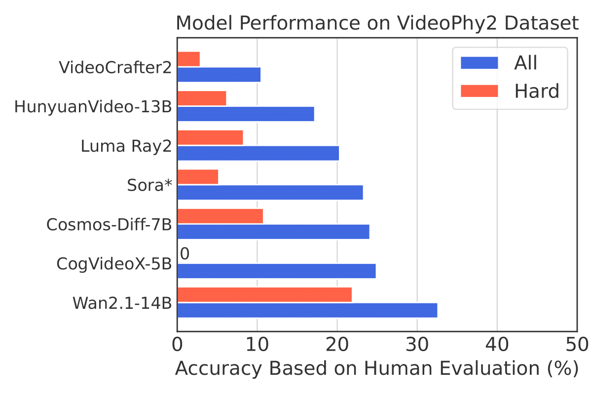
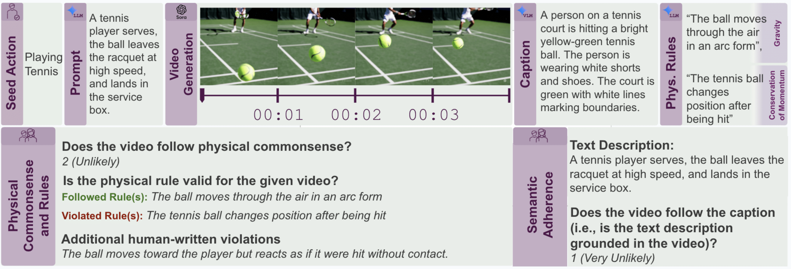

# VIDEOPHY-2

This repository contains the official implementation and data for "VideoPhy-2: A Challenging Action-Centric Physical Commonsense Evaluation in Video Generation".

[[Webpage](https://videophy2.github.io/)] [[Paper](https://github.com/Hritikbansal/videophy/blob/main/VIDEOPHY2/paper.pdf)] [[Test Dataset 🤗](https://huggingface.co/datasets/videophysics/videophy2_test)] [[Train Dataset 🤗](https://huggingface.co/datasets/videophysics/videophy2_train)] [[AutoRater 🤗](https://huggingface.co/videophysics/videophy_2_auto)] [[Twitter]()]

## Abstract
Large-scale video generative models, capable of creating realistic videos of diverse visual concepts, are strong candidates for general-purpose physical world simulators. However, their adherence to physical commonsense across real-world actions remains unclear (e.g., playing tennis, backflip). Existing benchmarks suffer from limitations such as limited size, lack of human evaluation, sim-to-real gaps, and absence of fine-grained physical rule analysis. To address this, we introduce VideoPhy-2, an action-centric dataset for evaluating physical commonsense in generated videos. We curate 200 diverse actions and detailed prompts for video synthesis from modern generative models. We perform human evaluation that assesses semantic adherence, physical commonsense, and grounding of physical rules in the generated videos. Our findings reveal major shortcomings, with even the best model achieving only 22% joint performance (i.e., high semantic and physical commonsense adherence) on the hard subset of VideoPhy-2. We find that the models particularly struggle with conservation laws like mass and momentum. Finally, we also train VideoPhy-2-AutoEval, an automatic evaluator for fast, reliable assessment on our dataset. Overall, VideoPhy-2 serves as a rigorous benchmark, exposing critical gaps in video generative models and guiding future research in physically-grounded video generation.

<h1 align="center"></h1>
<h1 align="center"></h1>

## Human LeaderBoard 🏆
We evaluate 7 closed and open text-to-video generative models on VideoPhy-2 dataset with **human annotation**. We report the joint performance. It is computed by aggregating the percentage of testing prompts for which the T2V models generate videos that adhere to the conditioning caption (SA>=4) and exhibit high physical commonsense (PC>=4). We also present a hard subset of the data, which is constructed using CogVideoX-5B as the reference model.

<div align="center">

| **#** | **Model** | **Source** | **All** | **Hard** | 
| -- | --- | --- | --- | --- | 
| 1      | [Wan2.1-T2V-14B](https://huggingface.co/Wan-AI/Wan2.1-T2V-14B)🥇 | Open |  32.6  | 21.9   | 
| 2 | [CogVideoX-5B](https://huggingface.co/THUDM/CogVideoX-5b)🥈 | Open | 25.0 | 0 | 
| 3 | [Cosmos-Diffusion-7B](https://huggingface.co/nvidia/Cosmos-1.0-Diffusion-7B-Text2World)🥉 | Open |24.1 | 10.9 | 
| 4 | [OpenAI Sora*](https://openai.com/sora/) | Closed |23.3 | 5.3 |
| 5 | [Luma Ray2](https://lumalabs.ai/ray) | Closed | 20.3 | 8.3 | 
| 6 | [HunyuanVideo-13B](https://huggingface.co/tencent/HunyuanVideo) | Open  | 17.2   | 6.2  |
| 7 | [VideoCrafter2](https://huggingface.co/VideoCrafter/VideoCrafter2) | Open | 10.5 | 2.9 | 

* We manually evaluate OpenAI Sora on a subset of 60 promptss using its UI due to the lack of an API.

</div>

## VideoPhy-2-AutoEval


### Installation

1. Follow the same instructions mentioned in the VideoPhy-1 [README](release/videophy/README.md).

2. In this work, we propose an auto-evaluator for our dataset. 

The model checkpoint is publicly available on [🤗 Model](https://huggingface.co/hbXNov/videophy_2_auto/tree/main).

### Inference

1. Download the model checkpoint to your local machine. 
```python
git lfs install
git clone https://huggingface.co/videophysics/videophy_2_auto/
```
2. Since this model was trained in a multi-task setting, it can be used for semantic adherence judgment, physical commonsense judgment, and physical rule classification.

```
    Semantic Adherence: Outputs a score that is one of 1-5 [Higher the Better]
    Physical Commonsense: Outputs a score that is one of 1-5 [Higher the Better]
    Physical Rule: Classifies whether a particular physical rule is grounded in the generated video. [0 - violation, 1 - adherence, 2 - rule cannot be grounded in the video]
```
3. We present the multimodal template for these tasks in [template.py](template.py). 

4. Semantic Adherence Inference
- We need to have a csv containing two columns `videopath` and `caption`. Here, the aim is to judge whether the caption is grounded in the video or not. We present an example [sa_pc.csv](examples/sa_pc.csv).
- Inference command:
```python
CUDA_VISIBLE_DEVICES=0 python inference.py --input_csv examples/sa_pc.csv  --checkpoint <path_to_dir/videophy_2_auto> --output_csv examples/output_sa.csv --task sa
```
- This will result in `output_sa.csv` w/ an extra column `score`.
4. Physical Commonsense Infernece
- We need to have a csv containing two columns `videopath`. Here, the aim is to judge whether the generated video is physical likely. We present an example [sa_pc.csv](examples/sa_pc.csv).
- Inference command:
```python
CUDA_VISIBLE_DEVICES=0 python inference.py --input_csv examples/sa_pc.csv  --checkpoint <path_to_dir/videophy_2_auto> --output_csv examples/output_pc.csv --task pc
```
- This will result in `output_pc.csv` w/ an extra column `score`.
5. The joint score is defined as the fraction of instances for which the semantic adherence is high as well as the physical commonsense is high (SA>=4, PC>=4).
6. Physical Rule Inference
- We need to have a csv containing two columns `rule` and `videopath`. Here, the aim is to judge whether the physical rule is grounded in the video or not. We present an example [rule.csv](examples/rule.csv).
- Inference command:
```python
CUDA_VISIBLE_DEVICES=0 python inference.py --input_csv examples/rule.csv  --checkpoint <path_to_dir/videophy_2_auto> --output_csv examples/output_rule.csv --task rule
```
- This will result in `output_rule.csv` w/ an extra column `score`.

### Training VideoPhy2-Auto

#### Data

1. We release the training data on Huggingface dataset - [train_dataset](https://huggingface.co/datasets/videophysics/videophy2_train).
2. You have to convert this data into instruction tuning format with appropriate multimodal templates for semantic adherence, physical commonsense, and rule prediction task (same as VideoPhy-1). We have provided the templates in [template.py](template.py) 
3. For training, follow the same instructions mentioned in the VideoPhy-1 [README](https://github.com/Hritikbansal/videophy?tab=readme-ov-file#training). 
4. One critical thing to note is that VideoPhy-2-AutoEval trains the [VideoPhy-1 auto-rater](https://huggingface.co/videophysics/videocon_physics/tree/main) instead of VideoCon. 

### Citation
```

```
